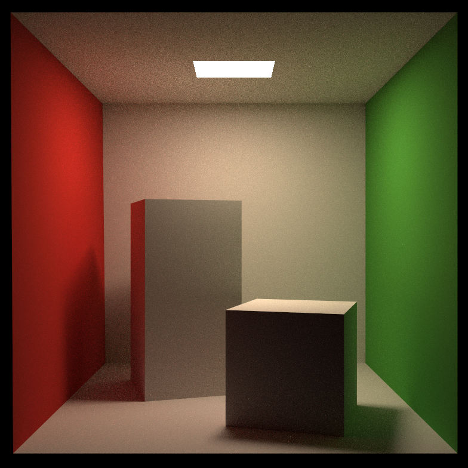
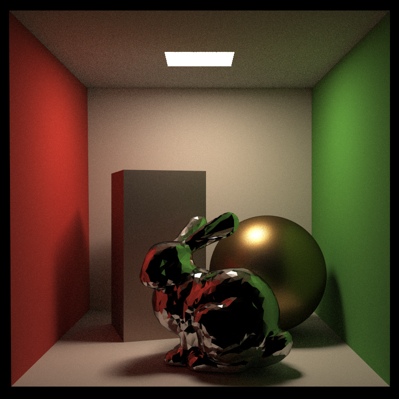
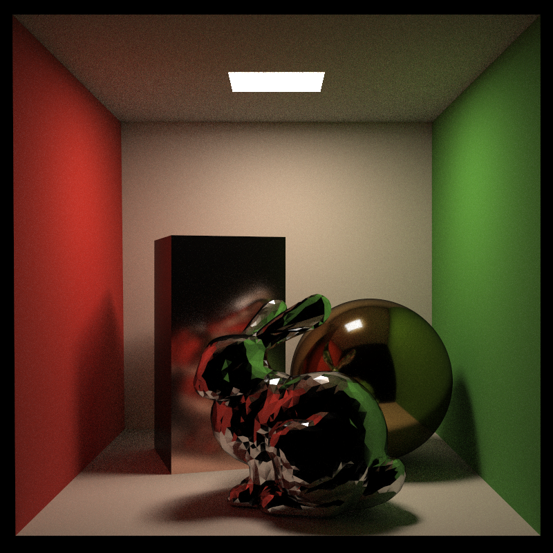
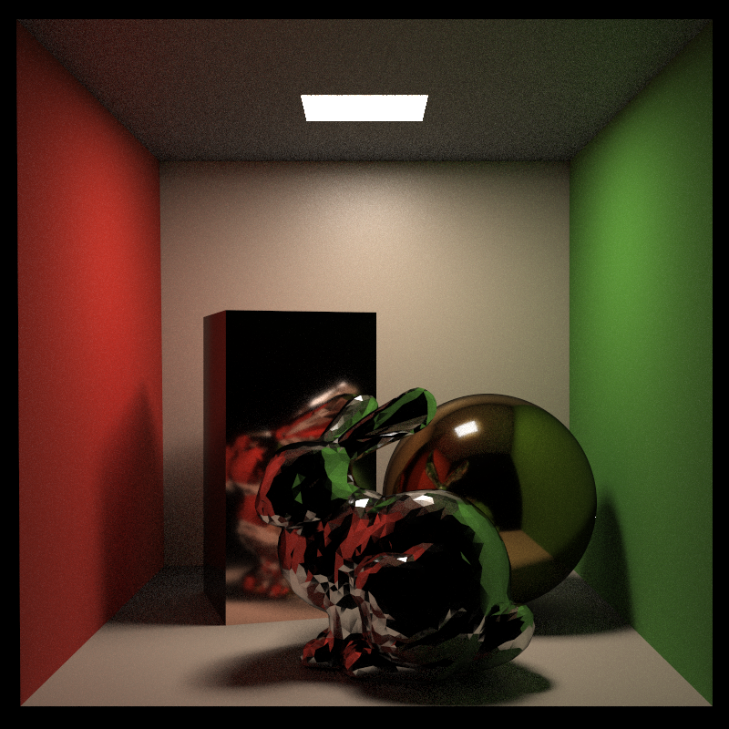
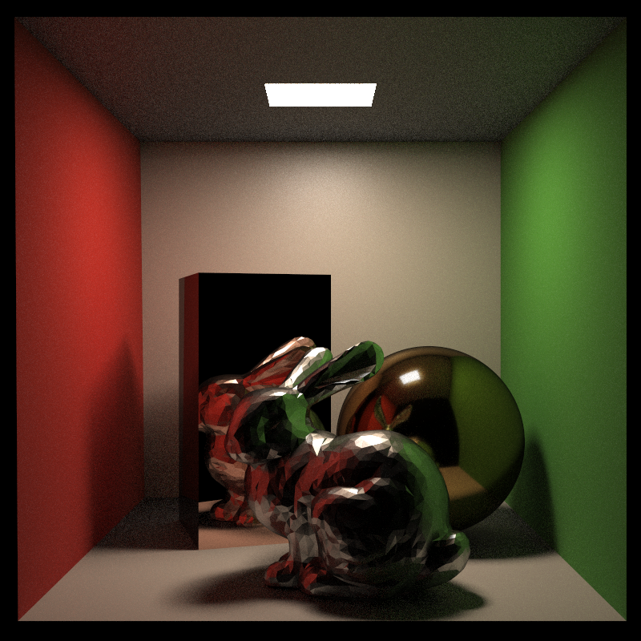

# Overview
This public repo is a showcase of a path tracing renderer implemented for a course project.

# Features
- Monte Carlo Path Tracing
- Pure Diffuse Materials
- Microfacet Materials
  - Importance Sampling for glossy reflection
  - Metallic Workflow for computing metallic color

# Results

# How to Get the Code

Due to academic integrity policies, I cannot push the project source code to this public repository. However, the source code is available in a private repository, and access may be granted if you contact me through email and provide your Github email for an invite.

- Email: yutong.huang@outlook.com